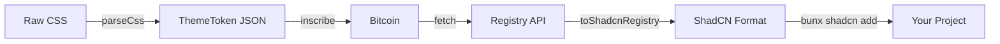

# @theme-token/sdk

The core library for [Theme Token](https://themetoken.dev). Handles validation, parsing, and transformation of themes between raw CSS, on-chain storage format, and ShadCN Registry format.

## Why This Exists

ShadCN CLI (`bunx shadcn add <url>`) expects a specific JSON format with resolved color values—not raw CSS. This SDK bridges that gap.



## Installation

```bash
bun add @theme-token/sdk
```

## Usage

### Parse CSS to ThemeToken

Convert raw CSS into structured JSON for inscription. Automatically resolves `var()` references.

```typescript
import { parseCss } from "@theme-token/sdk";

const css = `
:root {
  --background: oklch(1 0 0);
  --foreground: oklch(0.145 0 0);
  --primary: oklch(0.6 0.15 250);
  --primary-foreground: oklch(0.98 0 0);
  --radius: 0.5rem;
  /* ... */
}
.dark {
  --background: oklch(0.145 0 0);
  --foreground: oklch(0.98 0 0);
  /* ... */
}
`;

const result = parseCss(css, "My Theme");
if (result.valid) {
  console.log(result.theme); // Ready to inscribe
}
```

### Transform to ShadCN Registry

```typescript
import { toShadcnRegistry } from "@theme-token/sdk";

const registryItem = toShadcnRegistry(theme);
// { $schema, name, type: "registry:style", cssVars: { light, dark } }
```

### Fetch from Blockchain

```typescript
import { fetchThemeByOrigin } from "@theme-token/sdk";

const published = await fetchThemeByOrigin("85702d92...cf_0");
if (published) {
  console.log(published.theme.name);
}
```

### Apply at Runtime

```typescript
import { applyThemeMode } from "@theme-token/sdk";

applyThemeMode(theme, "dark");
```

### Convert to CSS

```typescript
import { toCss } from "@theme-token/sdk";

const css = toCss(theme);
// :root { --background: oklch(...); ... }
// .dark { --background: oklch(...); ... }
```

---

## API Reference

### Parsing and Validation

| Function | Description |
|:---------|:------------|
| `parseCss(css, name?)` | Parse CSS string to ThemeToken, resolving `var()` references |
| `validateThemeToken(data)` | Validate unknown JSON against schema |
| `themeTokenSchema` | Zod schema for direct validation |

### Transformation

| Function | Description |
|:---------|:------------|
| `toShadcnRegistry(theme)` | Convert to ShadCN Registry format |
| `toCss(theme)` | Convert to CSS string |
| `toJson(theme, pretty?)` | Convert to JSON string |

### Network

| Function | Description |
|:---------|:------------|
| `fetchThemeByOrigin(origin)` | Fetch theme from blockchain |
| `fetchPublishedThemes()` | Fetch all published themes |
| `getRegistryUrl(origin)` | Get registry URL for ShadCN CLI |

### Runtime

| Function | Description |
|:---------|:------------|
| `applyTheme(styles)` | Apply style props to document |
| `applyThemeMode(theme, mode)` | Apply light or dark mode |
| `getCurrentTheme()` | Read current theme from DOM |
| `clearTheme()` | Remove all theme variables |

---

## ThemeToken Format

```typescript
interface ThemeToken {
  $schema: string;
  name: string;
  author?: string;
  styles: {
    light: ThemeStyleProps;
    dark: ThemeStyleProps;
  };
}
```

Colors use OKLCH: `oklch(L C H)` where L is lightness (0–1), C is chroma (0–0.4), H is hue (0–360).

---

## License

MIT
