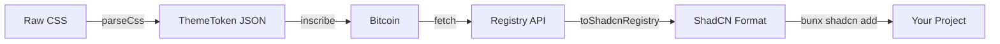

# @theme-token/sdk

The core library for [Theme Token](https://themetoken.dev). Handles validation, parsing, and transformation of themes between raw CSS, on-chain storage format, and ShadCN Registry format.

## Why This Exists

ShadCN CLI (`bunx shadcn add <url>`) expects a specific JSON format with resolved color values—not raw CSS. This SDK bridges that gap.


```mermaid
flowchart LR
    A[Raw CSS] -->|parseCss| B[ThemeToken JSON]
    B -->|inscribe| C[Bitcoin]
    C -->|fetch| D[Registry API]
    D -->|toShadcnRegistry| E[ShadCN Format]
    E -->|bunx shadcn add| F[Your Project]
```

## Installation

```bash
bun add @theme-token/sdk
```

## Usage

### Parse CSS to ThemeToken

Convert raw CSS into structured JSON for inscription. Automatically resolves `var()` references.

```typescript
import { parseCss } from "@theme-token/sdk";

// completeShadcnCss contains :root and .dark blocks with all 19 semantic
// color variables plus --radius in each mode.
const result = parseCss(completeShadcnCss, "My Theme");
if (result.valid) {
  console.log(result.theme); // Ready to inscribe
}
```

### Transform to ShadCN Registry

```typescript
import { toShadcnRegistry } from "@theme-token/sdk";

const registryItem = toShadcnRegistry(theme);
// { $schema, name, type: "registry:style", cssVars: { light, dark } }
```

### Fetch from Blockchain

```typescript
import { fetchThemeByOrigin } from "@theme-token/sdk";

const published = await fetchThemeByOrigin("85702d92...cf_0");
if (published) {
  console.log(published.theme.name);
}
```

### Apply at Runtime

```typescript
import { applyThemeMode } from "@theme-token/sdk";

applyThemeMode(theme, "dark");
```

### React Hook

For React applications, use the dedicated hook from the `/react` entry:

```tsx
import { useThemeToken } from "@theme-token/sdk/react";

function ThemePicker({ ordinals }) {
  const {
    themeTokens,    // Filtered ThemeToken ordinals
    activeOrigin,   // Currently applied theme origin
    loadTheme,      // Load theme by origin
    resetTheme,     // Reset to default
    isLoading,      // Loading state
    error           // Error state
  } = useThemeToken(ordinals);

  return (
    <div>
      {themeTokens.map(t => (
        <button
          key={t.origin}
          onClick={() => loadTheme(t.origin)}
          disabled={isLoading}
        >
          {t.origin === activeOrigin ? "✓ " : ""}{t.origin.slice(0, 8)}...
        </button>
      ))}
      <button onClick={resetTheme}>Reset</button>
    </div>
  );
}
```

The hook automatically:
- Filters current `map.app === "theme-token"` / `map.type === "registry:style"` ordinals and legacy `ThemeToken` records
- Persists selection to localStorage
- Restores saved theme on mount
- Detects light/dark mode from document

### Convert to CSS

```typescript
import { toCss } from "@theme-token/sdk";

const css = toCss(theme);
// :root { --background: oklch(...); ... }
// .dark { --background: oklch(...); ... }
```

---

## API Reference

### Parsing and Validation

| Function | Description |
|:---------|:------------|
| `parseCss(css, name?)` | Parse CSS string to ThemeToken, resolving `var()` references |
| `validateThemeToken(data)` | Validate unknown JSON against schema |
| `themeTokenSchema` | Zod schema for direct validation |
| `themeAssetSchema` | Zod schema for optional immutable asset relationships |

### Transformation

| Function | Description |
|:---------|:------------|
| `toShadcnRegistry(theme)` | Convert to ShadCN Registry format |
| `toCss(theme)` | Convert to CSS string |
| `toJson(theme, pretty?)` | Convert to JSON string |

### Network

| Function | Description |
|:---------|:------------|
| `fetchThemeByOrigin(origin)` | Fetch packaged `theme.json` from 1sat.app, with legacy fallback |
| `fetchPublishedThemes()` | Fetch validated themes from the Theme Token index |
| `getRegistryUrl(origin)` | Get registry URL for ShadCN CLI |

### Runtime

| Function | Description |
|:---------|:------------|
| `applyTheme(styles)` | Apply style props to document |
| `applyThemeMode(theme, mode)` | Apply light or dark mode |
| `getCurrentTheme()` | Read current theme from DOM |
| `clearTheme()` | Remove all theme variables |

### React (`@theme-token/sdk/react`)

| Export | Description |
|:-------|:------------|
| `useThemeToken(ordinals)` | React hook for managing ThemeToken ordinals |

---

## ThemeToken Format

```typescript
interface ThemeToken {
  $schema: string;
  name: string;
  author?: string;
  assets?: ThemeAsset[];
  styles: {
    light: ThemeStyleProps;
    dark: ThemeStyleProps;
  };
}
```

Assets are optional relationships to immutable on-chain content. A source can
reference another output in the theme's transaction or an independently
published origin:

```typescript
const themeWithPattern: ThemeToken = {
  ...theme,
  assets: [{
    role: "background.page",
    kind: "pattern",
    source: { kind: "sibling", vout: 0 },
    mediaType: "image/svg+xml",
    integrity: `sha256:${patternSha256}`,
    delivery: "linked",
    render: { mode: "mask", repeat: "repeat" }
  }]
};
```

`integrity` binds the relationship to exact bytes. `required: false` lets an
installer omit an asset that has not reached its content index yet. Existing
Theme Token documents, including documents with `bundle`, remain valid.

Colors use OKLCH: `oklch(L C H)` where L is lightness (0–1), C is chroma (0–0.4), H is hue (0–360).

---

## License

MIT
